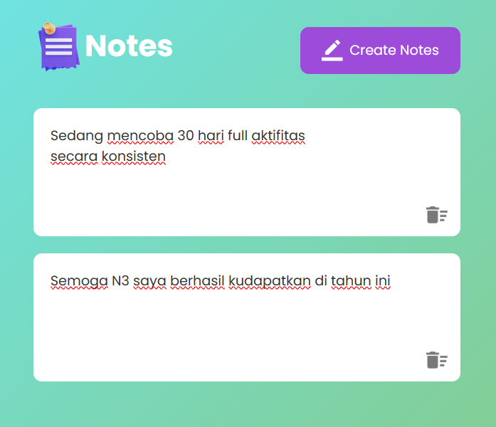

# Notes
This is a simple web application for creating and managing notes. Users can create, edit, and delete notes within a web interface. The application allows users to input text content, edit notes on-the-fly, and persist their notes locally using browser storage.

## Features
- Create Notes Button: Clicking the "Create Notes" button adds a new editable note to the notes container.
- Edit Notes: Users can click on any note to edit its content. The changes are automatically saved to the browser's local storage.
- Delete Notes: Each note has a delete button represented by a trashcan icon. Clicking this icon removes the associated note.
- Line Breaks: Pressing the "Enter" key within a note creates a line break without saving the note.

## Technologies Used
JavaScript: The application logic is written in JavaScript. It handles user interactions, updates the DOM, and manages local storage for note persistence.

## Local Storage
The application utilizes the browser's local storage to persistently store and retrieve notes. Notes are automatically loaded from local storage when the page is opened, and any changes made by the user are saved to local storage.

## image
